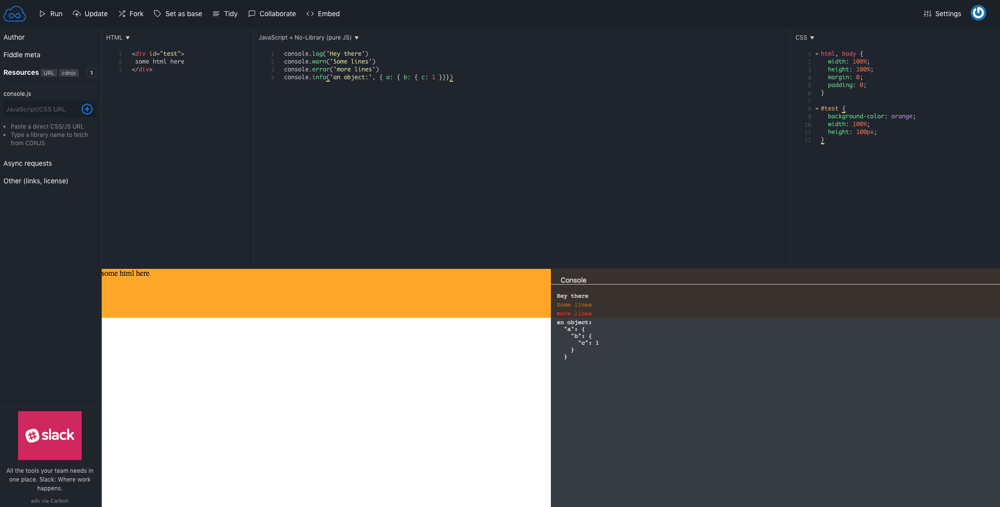

# jsfiddle-console

This a small script to show console output on [JSFiddle](https://jsfiddle.net/).  
It will look like below image:  

Just add  
`https://dogancana.github.io/jsfiddle-console/console.js`  
as resource to your fiddle and it will be there. 

Disable it by adding css rule:  
`
#console { display: none; }
`